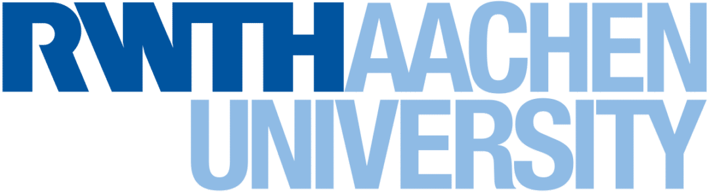

<h1 align="center">Hi there! I'm Ermanno 👋🏼</h1>

  

🎓 **Master's Student** in Electrical Engineering, Information Technology, and Computer Science at **RWTH Aachen University**.  
🧠 **Student Assistant** at [Forschungszentrum Jülich PGI-14](https://www.fz-juelich.de/en/pgi/pgi-14).  
👨‍💻 **Co-Founder** of [Young Neuromorphs](https://linktr.ee/youngneuromorphs).

---

### **🔬 Research Focus**
- Currently focused on **state-space models** implementation in **memristive hardware**.  
- Exploring the transition of **neuronal dynamics** to the **neuromorphic paradigm** for robust and energy-efficient computational systems.  
- Passionate about software and hardware co-design and applications in next-generation AI systems.

---

### **⚡ Key Areas of Interest**
- Neuromorphic Hardware & Architectures  
- Neuronal Modeling & Neuro-inspired Algorithms  
- Bioelectronics & Bio-inspired Computing  

---

<h2 align="center"> TECHNOLOGIES & TOOLS</h2>
 

    
    <!-- SystemVerilog as Text Badge -->
    
        SystemVerilog
    

<h3>LANGUAGES</h3>

<h2 align="center">🤝 Let's Connect! 🤝</h2>

 

  <!-- RWTH Aachen Logo -->
  
  &nbsp;&nbsp;&nbsp;&nbsp;
  <!-- Forschungszentrum Jülich Logo -->
  

---

  <i>"Bridging biology and engineering for the future of computing."</i>

    <i>
        
    </i>

