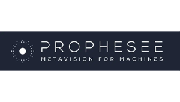
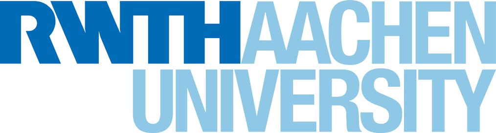

<h1 align="center">Hi, Ermanno here! 👋🏼</h1>

  

🎓 **Master's Student** in Electrical Engineering, Information Technology, and Computer Science at **RWTH Aachen University**.  
👨‍💻 **Software Engineer Intern** at [Prophesee](https://www.prophesee.ai/).  
👨‍💻 **Student Assistant** at [Forschungszentrum Jülich PGI-14](https://www.fz-juelich.de/en/pgi/pgi-14).  
🧠 **Co-Founder** of [Young Neuromorphs](https://linktr.ee/youngneuromorphs).

---

### **🔬 Research Focus**
- Currently working on dynamic vision sensors (**DVS**) characterization.
- Research studies focused on **state-space models** implementation in **analog memristive hardware**.  
- Exploring the transition of **neuronal dynamics** to the **neuromorphic paradigm** for robust and energy-efficient computational systems.  
- Passionate about software and hardware co-design and applications in next-generation AI systems.

---

### **⚡ Key Areas of Interest**
- Neuromorphic Hardware & Architectures  
- AI & Neuro-inspired Algorithms  
- Bioelectronics & Neuroscience 

---

<h2 align="center">TECHNOLOGIES & TOOLS </h2>

  <!-- Skillicons -->
    

  <!-- Extra Tools -->
  
  

---

  <h2>LANGUAGES</h2>
  
  
  

<h2 align="center">🤝</h2>

  <table>
    <tr>
      <td align="center" width="200" height="80">
        
      </td>
      <td align="center" width="200" height="80">
        
      </td>
      <td align="center" width="200" height="80">
        
      </td>
    </tr>
  </table>

---

    <i>
        
    </i>

